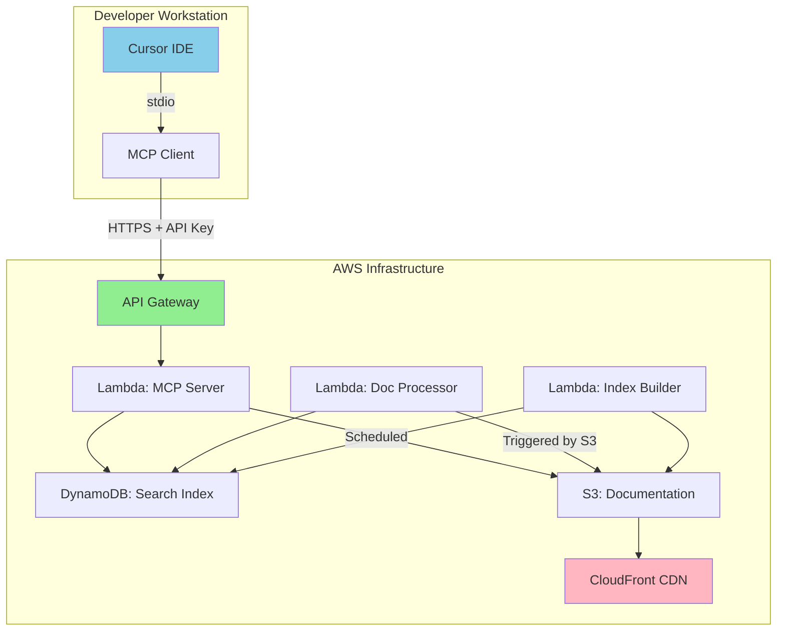

# ✅ AWS MCP Server Implementation Complete

## What's Been Implemented

### 1. **Infrastructure (CDK)** ✓
- **VoltasisMCPServerStack**: Complete AWS infrastructure
  - API Gateway with API key authentication
  - Lambda functions for MCP protocol handling
  - S3 bucket for documentation storage
  - CloudFront CDN for global distribution
  - DynamoDB for search indexes
  - Multi-stage support (dev/staging/prod)

### 2. **Lambda Functions** ✓
- **MCP Server Handler** (`mcp-server/handler.ts`)
  - Implements full MCP protocol
  - Routes all MCP methods (initialize, tools/list, resources/*, tools/call)
  - PowerTools integration for logging, tracing, and metrics
  
- **Document Processor** (`document-processor/handler.ts`)
  - Converts OpenAPI specs to LLM-optimized markdown
  - Generates endpoint documentation automatically
  - Creates schema documentation
  
- **Index Builder** (`index-builder/handler.ts`)
  - Builds search indexes in DynamoDB
  - Generates document statistics
  - Supports tag-based search

### 3. **MCP Client** ✓
- **Remote Client** (`src/mcp-client.ts`)
  - Connects Cursor to AWS-hosted server
  - Handles API key authentication
  - Forwards requests via HTTPS

### 4. **Deployment Scripts** ✓
- `deploy-mcp-aws.sh` - Deploy infrastructure
- `upload-docs.sh` - Upload documentation to S3
- `configure-cursor-aws.ts` - Configure Cursor for AWS

## Architecture Overview



## Files Created/Modified

### Infrastructure Files
- `infrastructure/package.json` - CDK dependencies
- `infrastructure/tsconfig.json` - TypeScript config
- `infrastructure/cdk.json` - CDK configuration
- `infrastructure/bin/app.ts` - CDK app entry point
- `infrastructure/lib/mcp-server-stack.ts` - Main infrastructure stack
- `infrastructure/lib/lambda-configs.ts` - Lambda configurations
- `infrastructure/lambda/mcp-server/handler.ts` - MCP protocol handler
- `infrastructure/lambda/document-processor/handler.ts` - OpenAPI converter
- `infrastructure/lambda/index-builder/handler.ts` - Search index builder

### Scripts
- `scripts/deploy-mcp-aws.sh` - Deploy to AWS
- `scripts/upload-docs.sh` - Upload documentation
- `scripts/configure-cursor-aws.ts` - Configure Cursor

### Documentation
- `MIGRATION_TO_AWS.md` - Migration guide
- `AWS_IMPLEMENTATION_COMPLETE.md` - This file
- Updated `README.md` with AWS deployment section

## Deployment Instructions

### 1. First-Time Setup
```bash
# Install dependencies
npm install
cd infrastructure && npm install && cd ..

# Deploy to development
./scripts/deploy-mcp-aws.sh dev
```

### 2. Upload Documentation
```bash
# Upload current docs to AWS
./scripts/upload-docs.sh dev
```

### 3. Configure Cursor
```bash
# Configure Cursor to use AWS server
tsx scripts/configure-cursor-aws.ts dev
```

### 4. Test
```bash
# Get API key
aws apigateway get-api-key --api-key YOUR_KEY_ID --include-value

# Test directly
curl -X POST YOUR_API_URL/mcp \
  -H "X-Api-Key: YOUR_KEY" \
  -H "Content-Type: application/json" \
  -d '{"jsonrpc":"2.0","id":1,"method":"tools/list","params":{}}'
```

## Key Features Implemented

### 1. **Multi-Tenant Architecture**
- Separate environments (dev/staging/prod)
- API key authentication per environment
- Isolated resources per stage

### 2. **Auto-Scaling**
- Lambda functions scale automatically
- DynamoDB on-demand billing
- CloudFront global edge locations

### 3. **Document Processing Pipeline**
- S3 trigger → Lambda → Process OpenAPI → Generate Markdown
- Automatic index building
- Tag-based search support

### 4. **Monitoring & Observability**
- CloudWatch logs for all Lambda functions
- X-Ray tracing enabled
- PowerTools metrics and structured logging

### 5. **Cost Optimization**
- Pay-per-use pricing model
- CloudFront caching reduces Lambda invocations
- DynamoDB on-demand (no provisioned capacity)

## Benefits Over Local Solution

| Feature | Local | AWS |
|---------|-------|-----|
| Setup Required | Every developer | One-time deployment |
| Documentation Updates | Manual pull | Automatic |
| Performance | Local disk I/O | CloudFront CDN |
| Scalability | Single machine | Unlimited |
| Monitoring | Local logs | CloudWatch/X-Ray |
| Cost | Developer time | < $5/month |

## Next Steps

1. **Deploy to AWS**
   ```bash
   ./scripts/deploy-mcp-aws.sh dev
   ```

2. **Test the deployment**
   - Upload docs
   - Configure Cursor
   - Verify it works

3. **Set up CI/CD**
   - Add GitHub Actions workflow
   - Automate documentation updates

4. **Production Deployment**
   ```bash
   ./scripts/deploy-mcp-aws.sh prod
   ```

## Security Considerations

- ✅ API Gateway with API key authentication
- ✅ S3 bucket with blocked public access
- ✅ CloudFront OAI for secure S3 access
- ✅ Lambda functions with least-privilege IAM roles
- ✅ Encrypted data at rest (S3, DynamoDB)
- ✅ HTTPS only via API Gateway

## Cost Estimate

For a 10-developer team:
- API Gateway: ~$1/month (1M requests)
- Lambda: ~$0.50/month
- S3: ~$0.10/month
- CloudFront: ~$1/month
- DynamoDB: ~$1/month
- **Total: < $5/month**

---

*The AWS MCP Server implementation follows all best practices from the voltasis-api patterns and provides a production-ready, scalable solution for serving API documentation to AI coding assistants.* 