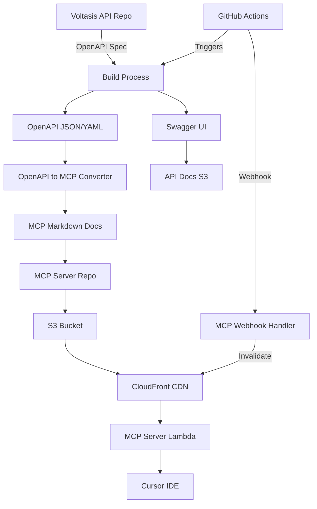

# OpenAPI to MCP Documentation Integration

This document describes the integration between the Voltasis API OpenAPI documentation and the MCP (Model Context Protocol) server documentation.

## Overview

The integration provides automatic synchronization of API documentation from OpenAPI specifications to MCP-friendly markdown format, ensuring that LLMs always have access to the latest API documentation.

## Architecture



## Integration Methods

### Method 1: Direct Script Integration (Recommended for Development)

Use the enhanced build script that includes MCP synchronization:

```bash
# From voltasis-api directory
./scripts/openapi-build-deploy-with-mcp.sh dev none false true
```

Parameters:
- `dev`: Stage (dev/staging/prod)
- `none`: Version bump (patch/minor/major/none)
- `false`: Deploy (true/false/docs-only)
- `true`: Sync MCP (true/false)

### Method 2: GitHub Actions Automation (Recommended for Production)

The workflow automatically syncs when:
- OpenAPI files are modified
- Lambda functions are updated
- Manual trigger via GitHub UI

### Method 3: Webhook Integration

The MCP server can receive webhooks when API documentation is updated:

1. Configure webhook in Voltasis API repository
2. Point to MCP webhook endpoint
3. Updates trigger automatic synchronization

## Setup Instructions

### 1. Initial Setup

```bash
# Clone both repositories
git clone https://github.com/voltasis/voltasis-api.git
git clone https://github.com/voltasis/voltasis-mcp-server.git

# Set environment variable
export MCP_SERVER_PATH="../voltasis-mcp-server"
```

### 2. Configure GitHub Secrets

Add these secrets to the Voltasis API repository:

- `MCP_WEBHOOK_SECRET`: Webhook secret for MCP server
- `AWS_ACCESS_KEY_ID`: AWS credentials
- `AWS_SECRET_ACCESS_KEY`: AWS credentials
- `GITHUB_TOKEN`: Token with write access to MCP repo (if using cross-repo commits)

### 3. Local Development Workflow

```bash
# 1. Make changes to OpenAPI spec
cd voltasis-api
vim docs/openapi.yaml

# 2. Build and sync
./scripts/openapi-build-deploy-with-mcp.sh dev none false true

# 3. Test locally
open docs/swagger-ui/index.html
cat ../voltasis-mcp-server/mcp-docs/api/endpoints/users-get.md
```

### 4. Production Deployment

```bash
# Deploy to production with full sync
./scripts/openapi-build-deploy-with-mcp.sh prod patch docs-only true
```

## File Structure

### Voltasis API Repository
```
voltasis-api/
├── docs/
│   ├── openapi.yaml              # Source OpenAPI spec
│   ├── openapi-split/            # Split OpenAPI files
│   └── swagger-ui/               # Built documentation
│       └── openapi.json          # Generated JSON
├── scripts/
│   ├── openapi-build-deploy.sh   # Original build script
│   ├── openapi-build-deploy-with-mcp.sh  # Enhanced with MCP
│   └── openapi-to-mcp.js         # Conversion script
└── .github/workflows/
    └── openapi-mcp-sync.yml      # Automation workflow
```

### MCP Server Repository
```
voltasis-mcp-server/
├── mcp-docs/
│   ├── api/
│   │   ├── endpoints/            # Generated endpoint docs
│   │   ├── schemas/              # Generated schema docs
│   │   └── overview.md           # API overview
│   └── index.json                # Search index
└── infrastructure/
    └── lambda/
        └── webhook-handler/      # Processes updates
```

## Conversion Process

The `openapi-to-mcp.js` script converts OpenAPI to MCP format:

1. **Endpoints**: Each path/method combination becomes a markdown file
2. **Schemas**: Each schema becomes a TypeScript interface with examples
3. **Metadata**: Frontmatter includes tags, version, and timestamps
4. **Code Examples**: Generated for cURL and TypeScript

### Example Conversion

OpenAPI:
```yaml
paths:
  /api/v1/users:
    get:
      summary: List users
      operationId: listUsers
      parameters:
        - name: limit
          in: query
          schema:
            type: integer
```

MCP Markdown:
```markdown
---
id: api-v1-users-get
title: List users
category: api
tags: [users]
method: GET
path: /api/v1/users
---

# List users

## Parameters

### Query Parameters

| Name | Type | Required | Description |
|------|------|----------|-------------|
| `limit` | `integer` | ❌ | - |

## Code Examples

### cURL
```bash
curl -X GET "https://api.voltasis.com/api/v1/users?limit=10"
```
```

## Monitoring and Troubleshooting

### Check Sync Status

```bash
# View GitHub Actions logs
gh run list --workflow=openapi-mcp-sync.yml

# Check MCP webhook logs
aws logs tail /aws/lambda/voltasis-mcp-webhook-handler-dev --follow

# Verify S3 upload
aws s3 ls s3://voltasis-mcp-docs-dev/mcp-docs/api/endpoints/
```

### Common Issues

1. **Sync fails with permission error**
   - Ensure GitHub token has write access to MCP repo
   - Check AWS credentials are valid

2. **Documentation not updating in Cursor**
   - Verify CloudFront invalidation completed
   - Check MCP server Lambda logs
   - Restart Cursor IDE

3. **Conversion errors**
   - Validate OpenAPI spec: `npx @apidevtools/swagger-cli validate docs/openapi.yaml`
   - Check for missing required fields

## Best Practices

1. **Version Management**
   - Always bump version when making API changes
   - Use semantic versioning
   - Tag releases for major versions

2. **Documentation Quality**
   - Include descriptions for all endpoints
   - Provide examples in OpenAPI spec
   - Use consistent naming conventions

3. **Performance**
   - Use split OpenAPI files for large APIs
   - Batch documentation updates
   - Monitor CloudFront cache hit rates

4. **Security**
   - Rotate webhook secrets regularly
   - Use least-privilege AWS IAM roles
   - Audit cross-repository access

## Future Enhancements

- [ ] Bi-directional sync (MCP changes back to OpenAPI)
- [ ] Automatic API client generation
- [ ] Documentation versioning with branches
- [ ] Real-time preview environments
- [ ] Integration with API testing tools 